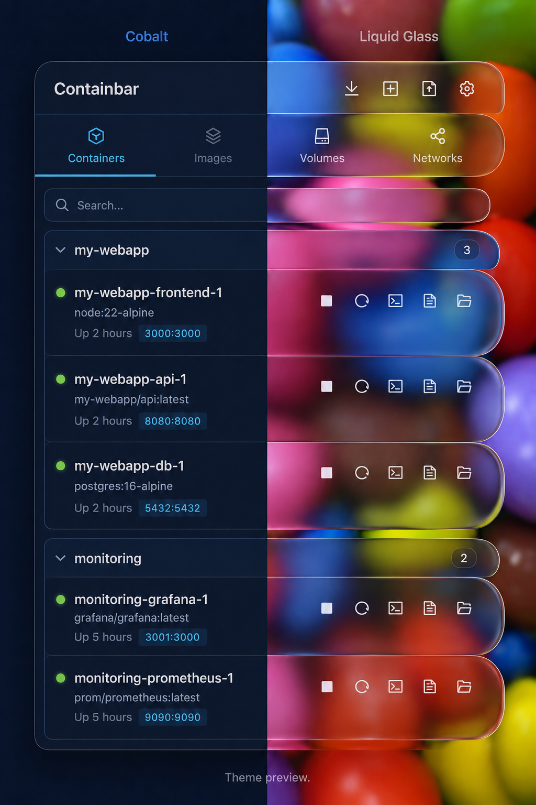

# Containbar

*Containers in your menu bar.*

Formerly Docker Tray. The app identifier and settings storage key remain unchanged for compatibility.
After upgrading, launch Containbar and reconfigure Start at Login.
You can remove the old Docker Tray.app after confirming the new app works.

<p align="center">
  
</p>

<p align="center">
  A lightweight macOS menu bar app for managing Docker, Colima, and Apple Container.
  <br/>
  Includes a built-in runtime (Colima) — no Docker Desktop required.
  <br/>
  <br/>
  <a href="https://www.apple.com/macos/"></a>
  <a href="https://nodejs.org/"></a>
  <a href="https://www.rust-lang.org/"></a>
  <a href="LICENSE"></a>
  <br/>
  <br/>
  English / <a href="./README_KO.md">한국어</a>
</p>

<p align="center">
  
  <br/>
  <sub>Cobalt / Liquid Glass — AI-generated theme concept, not an actual app capture.</sub>
</p>

## Features

### Docker Runtime
- **Built-in Runtime**: Bundles Colima (lightweight VM) — works without Docker Desktop or OrbStack
- **External Runtime Support**: Auto-detects Docker Desktop, OrbStack, etc.
- **Apple Container**: Supports Apple's `container` CLI on macOS 26+ with Apple Silicon and installs Mocker on demand for Compose
- **Auto Start**: Launches built-in runtime if no external Docker is found
- **Start at Login**: Toggle in Settings

### Container Management
- **System Tray**: Lives in your menubar, click to toggle, right-click to quit
- **Container Lifecycle**: Start, stop, restart, remove
- **Group Control**: Start/stop/remove entire Compose groups
- **Compose Support**: Import and run `docker-compose.yaml` files (Docker Compose on Docker/Colima, Mocker on Apple Container). When switching to Apple, Containbar identifies an existing Compose project that owns conflicting ports and can stop it after explicit confirmation.
- **Apple Compose Restore**: Preserves `restart: always` and `unless-stopped` intent on Apple Container, restoring eligible services and network host mappings after the runtime or app restarts
- **Image Management**: Pull, create containers from, and remove images
- **Volume & Network**: Browse and remove
- **Search/Filter**: Filter across all tabs by name, image, or driver
- **Detail View**: Click to see info + env vars, right-click to delete

### Log Viewer
- **Real-time Logs**: 1-second incremental polling, appends only new lines
- **Follow Tail**: Auto-scroll on new logs, auto-disables on manual scroll
- **Timestamp Toggle**: Show/hide with visual separation
- **Text Copy**: Select and Cmd+C to copy log text

### Tools
- **File Explorer**: Browse and transfer files inside containers
- **Terminal Access**: Open a shell into running containers (Ghostty, iTerm, Terminal.app)
- **Resizable Window**: Drag the bottom edge to adjust height

## Install

```bash
brew install --cask yurseria/tap/containbar
```

Requires [Homebrew](https://brew.sh), macOS 13+, and Apple Silicon. Update with `brew update` followed by `brew upgrade --cask yurseria/tap/containbar`.

The app is not Developer ID signed or notarized. If macOS blocks it, use **System Settings → Privacy & Security → Open Anyway** only if you trust the app. Homebrew does not bypass Gatekeeper. The v0.6.0 release still installs **Docker Tray.app**; a future renamed release will install **Containbar.app**.

See the [Homebrew Tap](https://github.com/yurseria/homebrew-tap) for existing-install guidance and [release integration](.github/HOMEBREW.md) for maintainers.

## Docker Runtime

Containbar works without Docker Desktop.

| | External Runtime | Built-in Runtime |
|---|---|---|
| **How** | Docker Desktop, OrbStack, etc. | Bundled Colima (lightweight VM) |
| **Detection** | Auto-detected on launch | Auto-starts when no external runtime |
| **Extra Install** | Not needed | Not needed (included in app) |
| **App Size** | 13MB | ~126MB (Colima + Lima + Docker CLI) |

On first run with built-in runtime, a VM image is downloaded (~200MB, one-time). A macOS notification is sent when ready.

## Tech Stack

- **Frontend**: React 19, TypeScript, Vite
- **Backend**: Rust, Tauri 2, Bollard (Docker API)
- **Runtime**: Colima, Lima, Docker CLI (bundled)
- **Node**: 22 (see `.nvmrc`)

## Prerequisites

Usage:
- macOS 13+

Development:
- [Rust](https://rustup.rs/)
- [Node.js 22+](https://nodejs.org/)
- [Colima](https://github.com/abiosoft/colima) (`brew install colima` — for runtime bundling)

## Development

```bash
npm install
npm run dev:tauri
```

## Build

```bash
# Bundle runtime (first build)
./scripts/bundle-runtime.sh

# Build app
npm run tauri build
```

The built app will be in `src-tauri/target/release/bundle/`.

## Project Structure

```
├── src/                    # React frontend
│   ├── components/         # UI components
│   ├── hooks/              # useDocker hook
│   └── types.ts            # TypeScript types
├── src-tauri/              # Rust backend
│   ├── src/
│   │   ├── docker.rs       # Docker API commands
│   │   ├── runtime.rs      # Colima runtime management
│   │   └── lib.rs          # Tauri app setup, tray, windows
│   ├── runtime/            # Bundled binaries (git ignored)
│   └── tauri.conf.json     # Tauri config
├── scripts/
│   └── bundle-runtime.sh   # Bundle Colima/Lima/Docker CLI
└── vite.config.ts
```

## License

MIT
